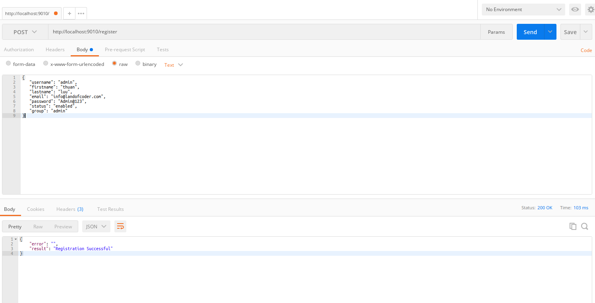
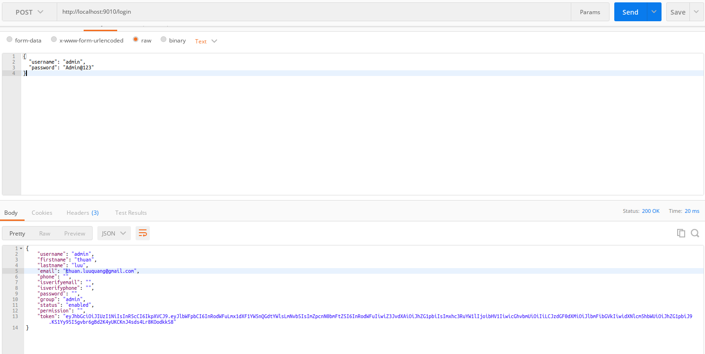
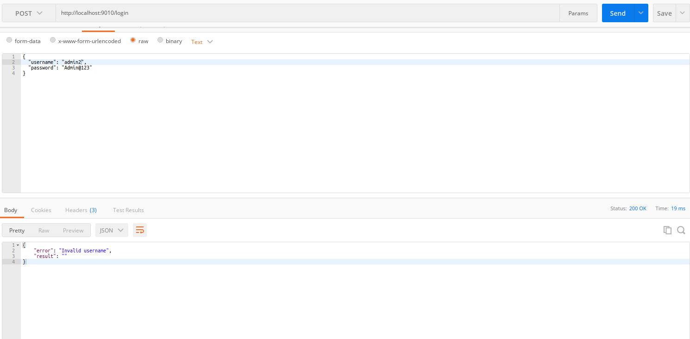

# Golang Auth with Open ID - Demo

This application will show you how to build and secure a register, login account. You'll create an API with Go and a frontend with React that will consume your API. You'll secure your API using Auth0 so that only authenticated users can access other features.

## Install
- Setup golang latest version: https://golang.org/doc/install
- Setup Mongodb: https://docs.mongodb.com/manual/tutorial/install-mongodb-on-ubuntu/
- Run commands:
1. Backend:
``cd backend``
``go run main.go .``

- The service will run at here: http://localhost:9010

2. Frontend:
``cd frontend``
``npm install``
``npm run start``

- The service will run at here: http://localhost:3000

## DEMO API
### 1.Register new user API
POST: http://localhost:9010/register

### 2.Login API
POST: http://localhost:9010/login

### 3.Profile API
GET: http://localhost:9010/profile

**People also search:**
- open id with golang and mongodb
- open id
- golang
- mongodb
- reactjs